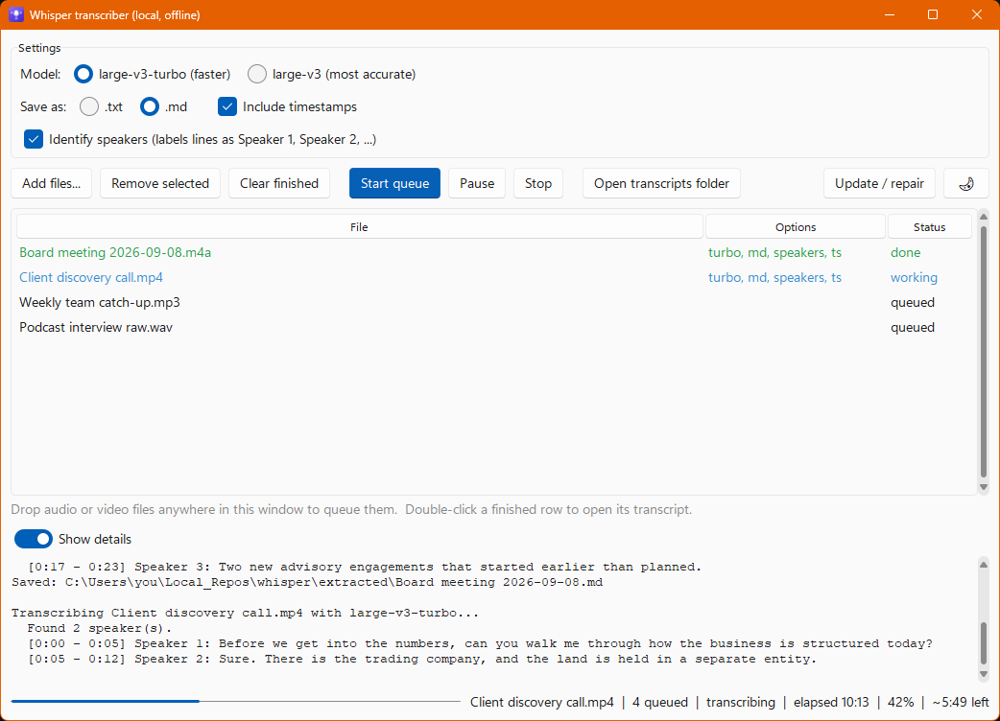
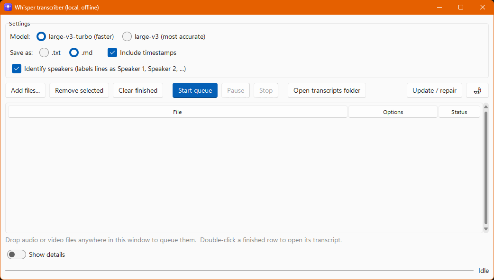
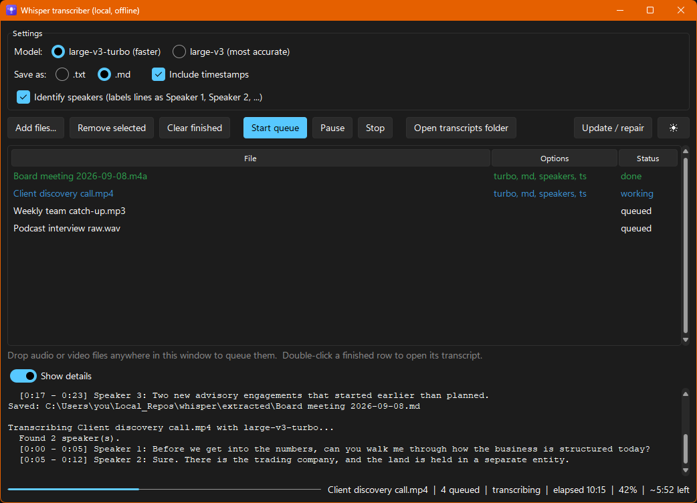
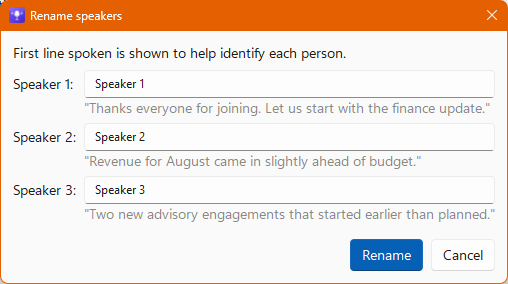
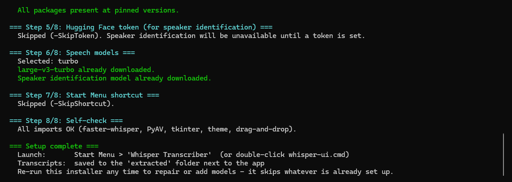

# Whisper Transcriber

Local, offline speech-to-text for Windows with speaker identification. Drop in meeting recordings, get back clean transcripts. Nothing leaves your laptop.



Built for a professional-services office where recordings are confidential, laptops are locked down (no admin rights, no FFmpeg, Intune managed) and nobody wants to learn a command line. Everything installs per-user with one double-click.

## What it does

- Transcribes audio and video files (mp3, m4a, wav, mp4, mov, mkv, flac, ogg, aac, wma, webm, avi) using OpenAI Whisper models, running on the CPU.
- Works out who said what (Speaker 1, Speaker 2, ...) and lets you rename the speakers afterwards.
- Runs fully offline once installed. The only thing that ever goes online is the installer and a one-off model download.
- Queues many files and processes them one after another. Pause, resume and stop are safe. Stopping saves what has been transcribed so far.
- Saves plain .txt or Markdown .md with optional timestamps on each paragraph. Never overwrites an existing transcript.
- Needs no admin rights, no FFmpeg, no GPU. Everything lives under your own user profile.
- Light and dark themes, drag and drop, a Start Menu shortcut and a proper taskbar icon.

## Screenshots

Screenshots show sample data, not real recordings.

| First launch | Dark theme |
| --- | --- |
|  |  |

Rename the detected speakers once a file has finished. The first line each person spoke is shown to help you work out who is who.



## How it works

- Speech recognition uses [faster-whisper](https://github.com/SYSTRAN/faster-whisper), a CTranslate2 port of OpenAI Whisper. Models run in int8 on the CPU, and a couple of cores are left free so the laptop stays usable while a long job runs.
- Speaker identification uses the [pyannote.audio](https://github.com/pyannote/pyannote-audio) speaker-diarization-community-1 pipeline. Each Whisper segment is assigned to the speaker whose turn overlaps it most.
- Audio is decoded in memory with PyAV, which ships inside the faster-whisper wheel. That is why FFmpeg is not required.
- Only one Whisper model is held in memory at a time, and nothing heavy loads until you click Start queue. Idle memory use is a few hundred MB. This is what makes it workable on 16 GB laptops.
- Hugging Face offline mode is switched on at import time, so once a model is cached the libraries make no network calls at all, not even version checks. A deliberate download temporarily lifts the flag and restores it afterwards.

## Requirements

- Windows 10 or 11, 64-bit. The app uses Windows-only APIs (registry, shell, taskbar identity) and has not been tested elsewhere.
- About 8 GB of free disk for a fresh install (Python environment plus models).
- 16 GB RAM for the standard model. 32 GB recommended if you want the larger, slower large-v3 model as well.
- Internet access during installation only.
- No admin rights. If Python 3.12 is not already present the installer fetches a per-user copy. Other Python versions on the machine are left alone and not used, because several pinned packages no longer ship Windows wheels for 3.10 or 3.11.

## Install

### 1. Get the code

Download the source zip for the latest release from https://github.com/thatskiff33/whisper-transcriber/releases and extract it. Releases are tagged and tested; the green Code button gives you whatever is on `main` right now. Developers can clone instead:

```bash
git clone https://github.com/thatskiff33/whisper-transcriber.git
```

Put the folder somewhere that is not synced by OneDrive, for example `C:\Users\<you>\Local_Repos\whisper-transcriber`. Transcripts are saved into an `extracted` folder next to the app, and you probably do not want those syncing to the cloud. The installer warns you if it detects a OneDrive path.

### 2. Run the installer

Double-click `install.cmd`. It runs `install.ps1` with a process-scoped execution policy bypass, which works on locked-down machines because nothing system-wide changes.

The installer walks through eight steps and prints what it is doing at each one:

1. Preflight. Checks free disk space, warns about OneDrive, reports installed RAM.
2. Python. Finds an existing CPython 3.12, or installs Python 3.12 per-user.
3. Virtual environment. Creates `%LOCALAPPDATA%\whisper\.venv`.
4. Packages. Installs the pinned dependency set from `requirements.txt`, wheels only, about 1.2 GB.
5. Hugging Face token. Optional, only needed for speaker identification. See the next section.
6. Speech models. Asks whether you want Standard (large-v3-turbo, about 1.6 GB) or Full (adds large-v3, about 3 GB more). It suggests a default based on your RAM.
7. Start Menu shortcut. Adds Whisper Transcriber to the Start Menu with the app icon.
8. Self-check. Imports every component to confirm the install works.

A completed run looks like this (this example skipped the token and shortcut steps):



The installer is idempotent. Run it again at any time to repair packages or add the larger model. It skips whatever is already in place.

### 3. Launch

Start Menu, search for Whisper Transcriber. Or double-click `whisper-ui.cmd` in the app folder.

### Unattended install

For rolling out to several machines, `install.ps1` accepts switches so it never stops to ask:

```powershell
powershell -NoProfile -ExecutionPolicy Bypass -File install.ps1 -Models turbo -SkipToken
```

| Switch | Effect |
| --- | --- |
| `-Models turbo` | Standard install, large-v3-turbo only |
| `-Models full` | Turbo plus large-v3 |
| `-SkipModels` | Do not download models now. The app offers to download on first use. |
| `-SkipToken` | Skip the Hugging Face token step. Speaker identification stays unavailable until a token is set. |
| `-SkipShortcut` | Do not create the Start Menu shortcut |

## Speaker identification setup (optional, free)

Telling speakers apart uses a pyannote model that is gated on Hugging Face. You need a free account and a read token. Plain transcription works without any of this.

1. Create a Hugging Face account at https://huggingface.co/join
2. Open https://huggingface.co/pyannote/speaker-diarization-community-1 and accept the terms. It is one click and access is instant. The installer also lists https://huggingface.co/pyannote/speaker-diarization-3.1. Accepting that one too is harmless, but only community-1 is used.
3. Create a token of type Read at https://huggingface.co/settings/tokens
4. Paste the token into the installer when it asks. If you skipped that step, run `install.cmd` again.

The installer stores the token as the `HF_TOKEN` user environment variable, verifies it against Hugging Face, confirms the gated model is accessible, and downloads the model (about 100 MB). After that the token is not used for anything. Your audio never leaves the machine.

## Choosing a model

| Install choice | Disk | Suits | Notes |
| --- | --- | --- | --- |
| Standard (large-v3-turbo) | about 1.6 GB | 16 GB RAM laptops | Excellent accuracy, reasonable speed |
| Full (turbo plus large-v3) | about 4.6 GB | 32 GB RAM machines | large-v3 is the most accurate but several times slower |

Rough guide from our own use: a one-hour recording takes about 15 to 30 minutes with turbo on a recent i5 or i7, faster on higher-end CPUs. large-v3 takes several times longer and is only worth it for difficult audio on a powerful laptop. Speaker identification adds a few minutes per hour of audio.

If you chose Standard and later select large-v3 in the app, it offers to download it rather than failing.

## Using the app

1. Drag audio or video files onto the window, or click Add files.
2. Pick the model, the output format (.txt or .md), and whether you want timestamps and speaker identification. Options are read when you click Start queue and apply to that whole run.
3. Click Start queue. The first run loads the model into memory, which takes around 15 seconds on a recent laptop. It stays loaded for later runs.
4. Watch the status line for the current file, the phase (identifying speakers, transcribing), elapsed time, percent complete and estimated time left. Flip on Show details to see the transcript being produced live.
5. When a file finishes, double-click its row to open the transcript, or right-click for Open transcript, Show in folder, Rename speakers and Remove from list.

Other behaviour worth knowing:

- Transcripts go into the `extracted` folder next to the app. Name clashes get a " (2)" suffix.
- Pause drops CPU use to zero until you resume. Stop saves a "(partial)" transcript of whatever has been done, and leaves the remaining files queued for the next Start.
- A failed file is marked failed and the queue moves on. Right-click it to see the error.
- Your options, window size, theme and whether the details log is open are remembered between sessions.

A Markdown transcript with speakers and timestamps looks like this:

```markdown
# Transcript: Board meeting 2026-09-08.m4a

- Source: C:\Recordings\Board meeting 2026-09-08.m4a
- Model: large-v3-turbo
- Transcribed: 2026-09-10 14:32

[0:00] Speaker 1: Thanks everyone for joining. Let us start with the finance update.

[0:06] Speaker 2: Revenue for August came in slightly ahead of budget.
```

Consecutive lines from the same speaker are merged into one paragraph. Timestamps are M:SS under an hour and H:MM:SS above it.

## Where things live

| What | Where |
| --- | --- |
| App code | The folder you extracted or cloned |
| Transcripts | `extracted\` inside the app folder |
| Python environment | `%LOCALAPPDATA%\whisper\.venv` |
| UI settings | `%LOCALAPPDATA%\whisper\ui-settings.json` |
| Model weights | `%LOCALAPPDATA%\whisper-models` |
| Hugging Face token | `HF_TOKEN` user environment variable (optional) |
| Start Menu shortcut | `%APPDATA%\Microsoft\Windows\Start Menu\Programs\Whisper Transcriber.lnk` |

`%LOCALAPPDATA%` is chosen deliberately: it is per-user, needs no admin, and is never synced by OneDrive.

## Privacy and network behaviour

- Transcription never uses the network. Offline mode is enforced at the library level, so cached models load without any revision or telemetry calls.
- The installer goes online to fetch Python, packages and models.
- The Update / repair button in the app re-runs the installer in a separate window to reinstall packages at their pinned versions and fetch any missing models. It does not pull new code.
- If you select a model that is not yet downloaded, the app asks before downloading it.
- The Hugging Face token authorises one gated download. It is never sent anywhere else.

To verify for yourself, run a transcription and check that the venv Python has no connections to huggingface.co:

```powershell
Get-Process python, pythonw -ErrorAction SilentlyContinue | ForEach-Object { Get-NetTCPConnection -OwningProcess $_.Id -ErrorAction SilentlyContinue } | Where-Object State -eq Established
```

An empty result means no open connections.

## Uninstall

Delete these and you are back to a clean machine:

- `%LOCALAPPDATA%\whisper`
- `%LOCALAPPDATA%\whisper-models`
- The Whisper Transcriber Start Menu shortcut
- The app folder (move your `extracted` transcripts out first)
- Optionally the `HF_TOKEN` user environment variable and the per-user Python 3.12 if the installer added it

## Troubleshooting

- Running scripts is disabled. Always start via `install.cmd` or `whisper-ui.cmd`, not the .ps1 directly. They bypass the execution policy for that one process, which is allowed.
- Speakers option is greyed out. The token step was skipped or the gated model terms are not accepted yet. Re-run `install.cmd` and follow the token step.
- Install fails downloading packages. Usually network or VPN. Re-run `install.cmd`, it resumes where it left off.
- Model not installed dialog on Start queue. You picked large-v3 on a Standard install. Say yes to download it once, or switch back to turbo.
- App feels slow or fans are loud. Normal while transcribing. It leaves a couple of cores free so you can keep working. Pause if you need full speed elsewhere.
- Window opens off-screen after undocking. The app checks the saved position is on a live monitor and drops it if not. If you still cannot see it, delete `ui-settings.json`.
- Antivirus or Intune warnings. The app is plain Python running locally. Nothing needs admin. Point IT at this README.

## For developers

| File | Purpose |
| --- | --- |
| `transcribe_ui.py` | The tkinter UI (sv-ttk theme, drag and drop, queue, rename dialog, update button) |
| `transcriber_core.py` | Engine: model loading, diarisation, transcript rendering, queue worker. No tkinter. |
| `install.ps1` | Idempotent per-user installer. `install.cmd` is the double-click wrapper. |
| `whisper-ui.cmd` | Launches the UI with the venv pythonw.exe, no console window |
| `requirements.txt` | Full pinned freeze of a known-good environment. Install with wheels only. |
| `test_diarization.py` | End-to-end command-line check of diarisation plus transcription on one file |
| `make_icon.py` | Regenerates `whisper.ico` with Pillow |
| `CHANGELOG.md` | Release notes, one section per version. The Release workflow reads it. |
| `.github/workflows/` | `ci.yml` runs syntax checks, a wheels-only resolve of the pins, ruff and PSScriptAnalyzer on pull requests; `codeql.yml` scans weekly; `release.yml` tags and publishes a release. See [docs/RELEASING.md](docs/RELEASING.md). |
| `ruff.toml`, `.github/dependabot.yml` | Lint rule set and Dependabot schedule (monthly, grouped; torch family patch-only) |

Run from source without the shortcut:

```powershell
& "$env:LOCALAPPDATA\whisper\.venv\Scripts\python.exe" transcribe_ui.py
```

Dependencies are pinned on purpose. pyannote.audio 4.x, torch and huggingface_hub have moved quickly and several combinations break on CPU-only Windows without FFmpeg. If you upgrade, re-test speaker identification end to end with `test_diarization.py`.

Notes on pyannote 4.x that cost time to learn:

- The pipeline returns a DiarizeOutput wrapper. Use its `speaker_diarization` attribute, not the object itself.
- torchcodec cannot load without FFmpeg DLLs. Pass a decoded waveform dict instead of a file path.
- Do not set `HF_HUB_DISABLE_IMPLICIT_TOKEN`. The gated download relies on the token being picked up implicitly.

## Licence

This project is released under the [MIT Licence](LICENSE).

The repository contains only this project's own code. No model weights or third-party packages are redistributed here. The installer downloads them from PyPI and Hugging Face at install time under their own licences, listed below as verified on 17 September 2026.

| Component | Licence | Notes |
| --- | --- | --- |
| OpenAI Whisper (model architecture and original weights) | MIT | |
| mobiuslabsgmbh/faster-whisper-large-v3-turbo | MIT | CTranslate2 conversion of openai/whisper-large-v3-turbo |
| Systran/faster-whisper-large-v3 | MIT | CTranslate2 conversion of openai/whisper-large-v3 |
| faster-whisper, CTranslate2 | MIT | |
| pyannote.audio (library) | MIT | Copyright CNRS |
| pyannote/speaker-diarization-community-1 (model) | CC BY 4.0 | Gated: you accept sharing your contact details with pyannote to download it. Attribution required, commercial use permitted. |
| PyTorch | BSD-3-Clause | |
| sv-ttk, tkinterdnd2 | MIT | |

Attribution for the speaker identification model: the pyannote speaker-diarization-community-1 pipeline by pyannoteAI, released under CC BY 4.0. If you publish transcripts or derived work that relied on speaker identification, keep that attribution.

## Acknowledgements

Thanks to the faster-whisper, CTranslate2, pyannote, sv-ttk and tkinterdnd2 maintainers, and to OpenAI for releasing the Whisper weights under MIT.
